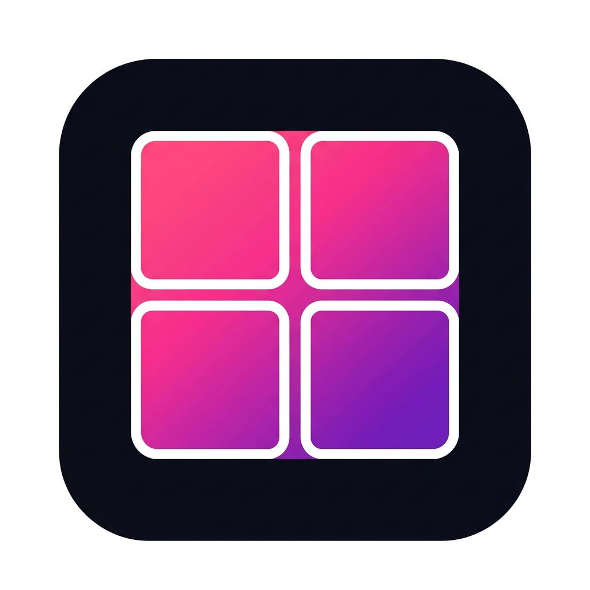

  

# PicCollage for Android

**A high-performance, native Android collage studio built with Jetpack Compose.**

PicCollage is designed for speed, precision, and aesthetic control. Unlike many collage apps that rely on heavy external libraries, this app uses a custom-built rendering engine to deliver high-resolution exports and a butter-smooth UI optimized specifically for Android phone devices.

<c></c>

## ✨ Premium Features

- **🎨 26 Dynamic Gradient Borders:** A massive library of Neon, Cyberpunk, Holographic, and Vaporwave-inspired gradients with varied flow directions (Diagonal, Radial, Top-Bottom).
- **📐 10 Pro-Style Layouts:** From single-frame highlights to complex 6-photo asymmetric grids.
- **🖼️ Slot-Based Photo Management:** Add photos exactly where you want them using the "+" buttons in empty cells.
- **🔄 Image Manipulation:** Rotate individual images by 90° or remove them instantly from the live preview.
- **🌈 Advanced Color Control:** Includes a full-spectrum color picker and a curated palette of vibrant solid colors.
- **📏 Dynamic Border Sizing:** Precision slider for border thickness (0 to 40px).
- **🚀 Optimized Rendering:** Collapsible UI drawers ensure the app remains lightning-fast by only loading assets when needed.
- **💾 High-Resolution Export:** Renders collages to a crisp 1080×1080 px file, saved directly to your phone's Gallery (`Pictures/PicCollage`).

## 📱 Device Specifications
- **Operating System:** Android 8.0+ (API 26+)
- **Device Type:** Optimized for Android Phones (Portrait Mode)
- **Hardware Requirements:** Efficiently runs on entry-level devices due to zero external library overhead.
- **Storage:** Lightweight APK size; saves high-quality JPEGs directly to local storage.

## 🛠️ Tech Stack
- **Language:** Kotlin
- **UI Framework:** Jetpack Compose (Material 3)
- **Concurrency:** Kotlin Coroutines (for background rendering and saving)
- **Rendering:** Custom `CollageRenderer` using Android `Canvas` and `Shader` APIs for pixel-perfect results.

## 🚀 Getting Started

1. **Clone the Repo:** `git clone https://github.com/YourUsername/PicCollage.git`
2. **Open in Android Studio:** Select the root project folder.
3. **Build & Run:** Hit the green **Run** button to deploy to your physical device or emulator.

---
*Created with focus on Rich Aesthetics and High Performance.*
